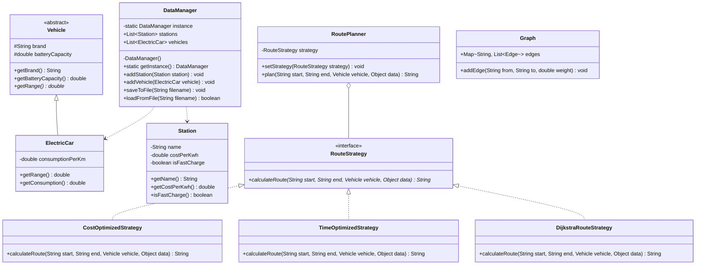

# UML Sınıf Diyagramı (Java)

```mermaid
classDiagram
    class DataManager {
        -static DataManager instance
        +List~Station~ stations
        +List~ElectricCar~ vehicles
        -DataManager()
        +static getInstance() DataManager
        +addStation(Station station) void
        +addVehicle(ElectricCar vehicle) void
        +saveToFile(String filename) void
        +loadFromFile(String filename) boolean
    }
    
    class Vehicle {
        <<abstract>>
        #String brand
        #double batteryCapacity
        +getBrand() String
        +getBatteryCapacity() double
        +getRange()* double
    }
    
    class ElectricCar {
        -double consumptionPerKm
        +getRange() double
        +getConsumption() double
    }
    
    class Station {
        -String name
        -double costPerKwh
        -boolean isFastCharge
        +getName() String
        +getCostPerKwh() double
        +isFastCharge() boolean
    }
    
    class RouteStrategy {
        <<interface>>
        +calculateRoute(String start, String end, Vehicle vehicle, Object data)* String
    }
    
    class CostOptimizedStrategy {
        +calculateRoute(String start, String end, Vehicle vehicle, Object data) String
    }
    
    class TimeOptimizedStrategy {
        +calculateRoute(String start, String end, Vehicle vehicle, Object data) String
    }
    
    class DijkstraRouteStrategy {
        +calculateRoute(String start, String end, Vehicle vehicle, Object data) String
    }
    
    class RoutePlanner {
        -RouteStrategy strategy
        +setStrategy(RouteStrategy strategy) void
        +plan(String start, String end, Vehicle vehicle, Object data) String
    }
    
    class Graph {
        +Map~String, List~Edge~~ edges
        +addEdge(String from, String to, double weight) void
    }

    Vehicle <|-- ElectricCar
    RouteStrategy <|.. CostOptimizedStrategy
    RouteStrategy <|.. TimeOptimizedStrategy
    RouteStrategy <|.. DijkstraRouteStrategy
    RoutePlanner o-- RouteStrategy
    DataManager ..> Station
    DataManager ..> ElectricCar
```